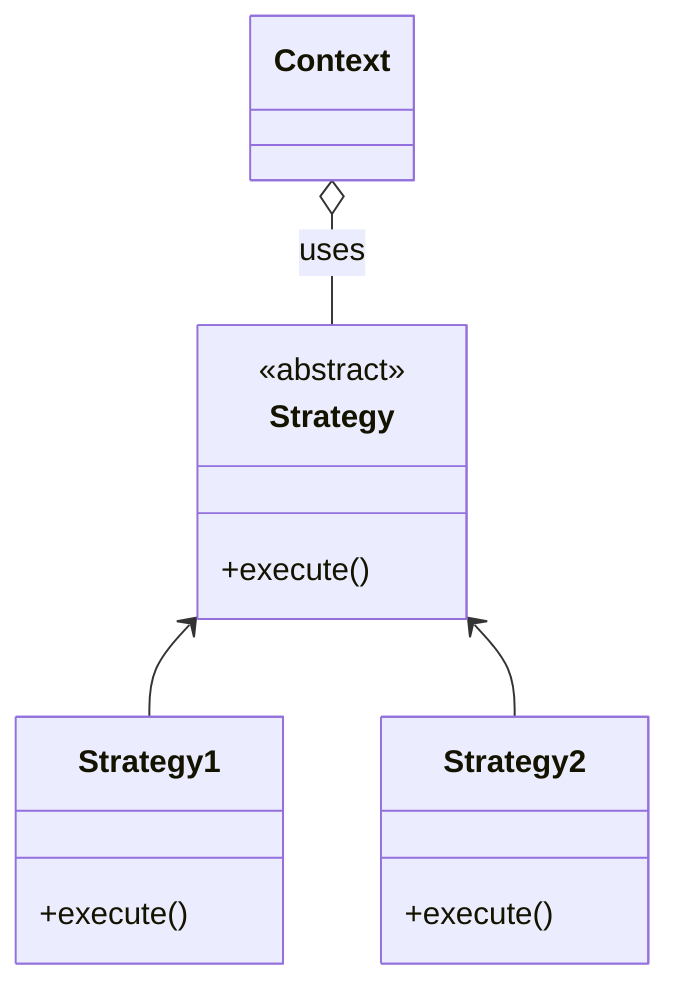

```mermaid
graph TD;
    A-->B;
    A-->C;
    B-->D;
    C-->D;
```

``` mermaid
classDiagram
    class Context
    Context o-- Strategy : uses
    class Strategy{
        <<abstract>>
        +execute()
    }
    Strategy <-- Strategy1
    Strategy <-- Strategy2
    Strategy1: +execute()
    Strategy2: +execute()

```